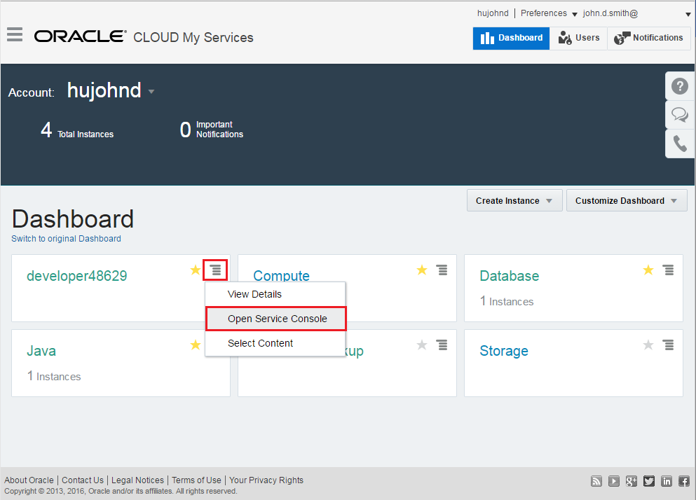
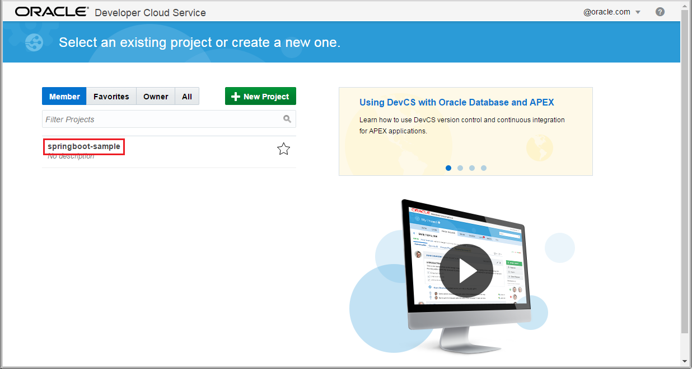

---
# ORACLE CanDo Workshop #

## Using the Agile Methodology in Oracle Developer Cloud Service ##

### About this tutorial ###
**Oracle Developer Cloud Service** is an integrated DevOps platform that enables projects planing and management by:
+ using Agile methodology to manage and track development sprints
+ using Issue Tracking to manage, track and prioritize tasks, and to manage defects, and features
+ using Team Management to assign ownership and track team execution

This tutorial shows how to use the Issue and Agile tabs of Oracle Developer Cloud Service to develop your project using Agile methodology.

### Prerequisites ###

- [Create and Deploy a SpringBoot Microservice with Developer Cloud Service & Application Container Cloud Service](../springboot-sample/README.md)

----

### Use the Agile methodology in your SpringBoot project ###

Sign in to [https://cloud.oracle.com/sign-in](https://cloud.oracle.com/sign-in). First select your datacenter then provide the identity domain and credentials. After a successful login you will see your Dashboard. Find the Developer services tile and click the hamburger icon. In the dropdown menu click **Open Service Console**.

Log in to Oracle Developer Cloud Services and open your springboot-sample project.

Before you start using the Agile methodology in Oracle Developer Cloud Service, it is important that you know the following key components of the Agile page.

- **Board** – A Board is used to display and update issues of the project. When you create a Board, you associate it with an Issue Query. The Board shows Issues returned by the Query.
You can either use a Board created by a team member, or create your own Board. You can create as many Boards as you like.
- **Sprint** – A Sprint is a short duration (usually, a week or two) during which your team members try to implement a product component.
You add the product component related issues to a Sprint. When you start working on a product component, you start (or activate) the related Sprints. To update issues using a Sprint, you must first activate the Sprint and add the Sprint to the Active Sprints view.
- **Backlog view** – Lists all Issues returned by the Board’s Query. The view also displays all active and inactive Sprints of the Board, and the sprints from other Boards that contain Issues matching the Board’s Query.
Each Sprint lists issues that are added to it. The Backlog section (the last section of the Backlog page) lists all open issues that are not part of any Sprint yet. The Backlog view does not show the resolved and closed Issues.
- **Active Sprints view** – Lists all active Sprints of the Board and enables you to update an Issue status simply by dragging and dropping it to the respective status columns.
- **Reports view** – select the Burndown Chart tab to display the amount of work left to do in a Sprint or use the Sprint Report tab to list open and completed Issues of a Sprint.

To develop your project using Agile methodology, **follow the instruction in the tutorial [Using Agile Methodology in Oracle Developer Cloud Service](http://www.oracle.com/webfolder/technetwork/tutorials/obe/cloud/developer/AgileDevelopment/AgileDevelopment.html)** as to use Agile in your springboot-sample project you can start following the instruction directly from section **`Creating a Project and Some Issues`**, point 6: 

`6. Once project provisioning is completed, you are automatically taken to your new project’s Project page. Click the Issues tab.`

Apply Agile instruction (names of issues, tasks etc.) to match your springboot-sample project.

