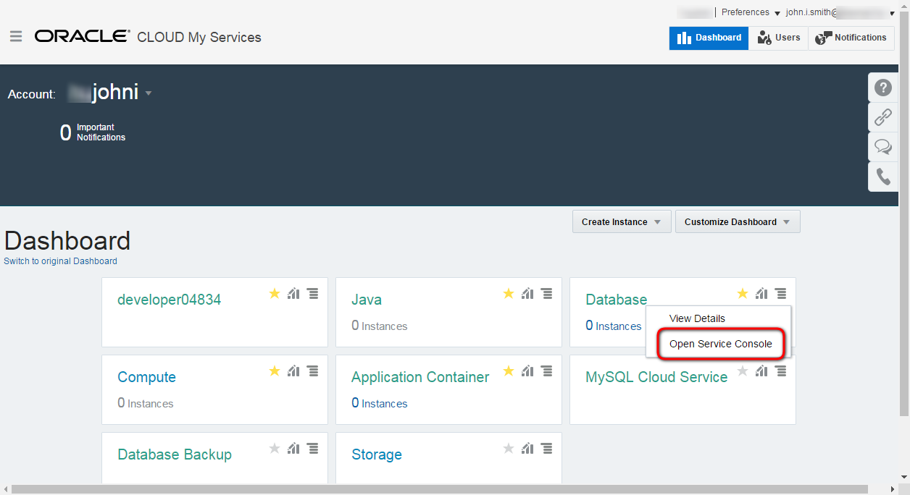

---
# ORACLE CanDo Workshop #
-----
## Create Database Cloud Service instance using user interface ##

### Introduction ###

Oracle Database Cloud Service provides you the ability to deploy Oracle databases in the Cloud, with each database deployment containing a single Oracle database. You have full access to the features and operations available with Oracle Database, but with Oracle providing the computing power, physical storage and (optionally) tooling to simplify routine database maintenance and management operations.

When you create database deployments, Database Cloud Service creates compute nodes to host the database, using computing and storage resources provided by Oracle Compute Cloud Service. Additionally, it provides access to the compute nodes (and thus to the database) using networking resources provided by Oracle Compute Cloud Service.

### About this tutorial ###
This tutorial demonstrates how to:
	
+ create Database Cloud Service using the user interface.

### Prerequisites ###

- Oracle Public Cloud Service account including Database and Storage Cloud Service

###Create a Database Cloud Service instance###

[Sign in](../common/sign.in.to.oracle.cloud.md) to [https://cloud.oracle.com/sign-in](https://cloud.oracle.com/sign-in). On the dashboard open the Database Cloud Service Console.

With the help of the Oracle documentation [Creating a Database Deployment](http://docs.oracle.com/en/cloud/paas/database-dbaas-cloud/csdbi/create-db-deployment.html), provision a new Database service instance with the following details below:

*NOTE: feel free to modify the details by will, but don't forget to note and remember your custom settings!*

 - **Service Name:**  the name of the service instance e.g. techcoDB
 - **Description:**  any description for your service
 - **Service Level:**  Oracle Database Cloud Service
 - **Metering Frequency:**  Monthly
 - **Software Release:**  Select the latest 12c release available
 - **Software Edition:** Enterprise Edition
 - **Database Type:** Single Instance
 - **DB Name (SID):** container database service identifier
 - **PDB Name:** pluggable database service identifier. You can leave the default PDB1
 - **Administration Password (*and Confirm Password*):** database instance's system password. Don't forget to note the provided password
 - **Usable Database Storage (GB):** leave default
 - **Total Data File Storage (GB):** leave default
 - **Compute Shape:**  choose the smallest (default) one
 - **SSH Public Key:** public key which will be uploaded to the VM during the creation. It allows to connect to the VM through ssh connection using the private key. You can upload a file containing your generated public key value, paste in the value of a public key, or create a system-generated key pair, or to avoid additional task of keypairs creation just select Create a New Key option and download the newly generated keypair for later usage. Download the zip file to your GIT_REPO_LOCAL_CLONE/cloud-utils folder and unzip for later usage. 
 - **Listener Port:** leave default 1251
 - **Timezone:** set your timezone
 - **Character Set and National Character Set:** leave default
 - **Enable Oracle GoldenGate:** don't check
 - **Include "Demos" PDB:** up to you (default is not checked)
 - **Backup Destination:** leave default; Both Cloud and Local Storage
 - **Cloud Storage Container:** the name of the container for database instance. The format is the following: Storage-IDENTITYDOMAIN/CONTAINERNAME. Replace the identitydomain value according to your environment and specify a container name. Container name is up to you. The container don't need to be created in advance, because -see below- there is an option to create automatically.
 - **Cloud Storage User Name and Password:** the credentials for storage. Usually it is the same what was used to sign in to Oracle Cloud Services.
 - **Create Cloud Storage Container:** if you haven't created a container in advance then check this because the container does not exist - a new container with the name that you specified above will be created.
 - **Total Estimated Monthly Storage:** leave default
 - **Initialize Data From Backup section -> Create Instance from Existing Backup:** No. I.e. don't select to create a database deployment whose database is taken from a cloud backup created using Oracle Database Backup Cloud Service.
 - **Standby Database Configuration:** don't choose this option

On the Confirmation page, review the information listed. If you are satisfied with the information, click **Create**.
If you need to change the information, use the navigation bar or **Back** button at the top of the wizard to step back through the pages in the wizard. Click **Cancel** to cancel out of the wizard without creating a new database deployment.

When the request has been accepted the Database Service Console page appears and shows the new instance. The instance now is in Maintenance (Progress) mode. Click on *In Progress* to get more information about the status. 

