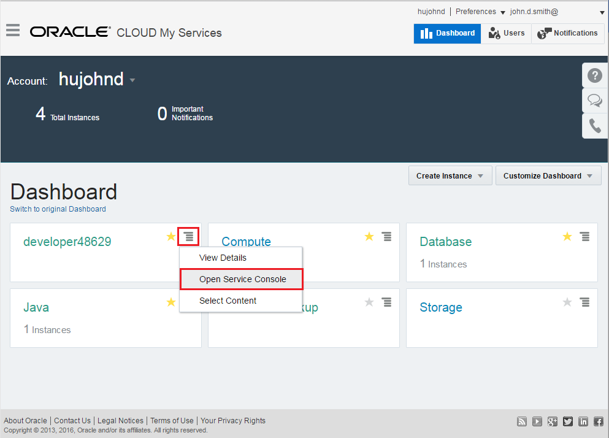
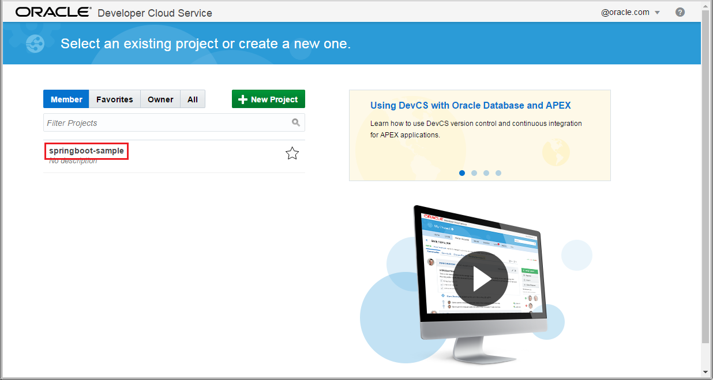

---
# ORACLE CanDo Workshop #
-----
## Continuous build integration using Git client with Oracle Developer Cloud Service and Application Container Cloud Service ##

### About this tutorial ###
Besides using Eclipse for your project, you can use any favourite Text editor and Git tool to create and modify your project and then push the code to Developer Cloud Service remote repository.

This tutorial shows how to use a Git client with Oracle Developer Cloud Service and Application Container Cloud Service.

### Prerequisites ###

- You have [created and deployed a SpringBoot Microservice with Developer Cloud Service & Application Container Cloud Service](../springboot-sample/README.md)
- You have configured a Build for the springboot-sample app based on SCM polling schedule
- (Optional) You have configured a Deploy configuration with Automatic deployment of springboot-sample app to Application Container Cloud Service 
- (Optional) You are familiar how to use the [Agile Methodology in Oracle Developer Cloud Service](../agile/README.md) 

----

#### Continuous build integration using Git client with Oracle Developer Cloud Service and Application Container Cloud Service ####

Sign in to [https://cloud.oracle.com/sign-in](https://cloud.oracle.com/sign-in). First select your datacenter then provide the identity domain and credentials. After a successful login you will see your Dashboard. Find the Developer services tile and click the hamburger icon. In the dropdown menu click **Open Service Console**.

Log in to Oracle Developer Cloud Services and open your springboot-sample project.

During the steps below you can play and improvise with Agile methodology in Developer Cloud Services according to your activities on the springboot-sample project.

On your springboot-sample project, in the Project page, within the REPOSITORIES section, under springboot-sample.git, copy the URL of your springboot-sample.git repo from the HTTP text-box. Tip, it should be something similar to: https://{yourDevCSProjectURI}/springboot-sample.git 

Clone your newly created springboot-sample.git Git repository hosted on DevCS to your local machine using basic or your favourite Git tool. 
Below is an example with Git Shell:
    
> cd {path_to_your_local_Git_repo_folder}		
> git clone https://{YourDevCSProjectURI}/springboot-sample.git 

Make some changes in the code. For example, edit the file:
 > src\main\webapp\WEB-INF\views\welcome.jsp

Push changes to DevCS remote springboot-sample repo (master). 
Below is an example with Git Shell:
> git commit -am "Edited welcome.jsp page"		
> git push -u origin master

On your *springboot-sample* project in Developer Cloud Services, observe the results in the Build and Deploy pages

